# Day 5 – Amazon S3 Hands-on Lab (Part 2)

## Objective

The objective of this hands-on lab was to practise advanced Amazon S3 features used for data replication, storage lifecycle management, access logging, batch operations, and event-driven notifications.

In this lab, I configured S3 replication between two buckets, replicated existing objects using S3 Batch Operations, created a lifecycle rule for automatic storage-class transitions, enabled server access logging, and integrated Amazon S3 with Amazon SNS to receive email notifications for object-level events.

---

## AWS Services Used

- Amazon Simple Storage Service (Amazon S3)
- Amazon Simple Notification Service (Amazon SNS)
- AWS Identity and Access Management (IAM)

---

## Features Practised

- S3 Replication Rules
- S3 Object Replication
- S3 Batch Operations
- S3 Batch Replication
- S3 Lifecycle Rules
- S3 Storage-Class Transitions
- S3 Server Access Logging
- Amazon SNS Topics
- SNS Email Subscriptions
- S3 Event Notifications
- Event-Driven Email Notifications

---

## Lab Architecture

### S3 Data Management Architecture

### S3 Data Management Architecture

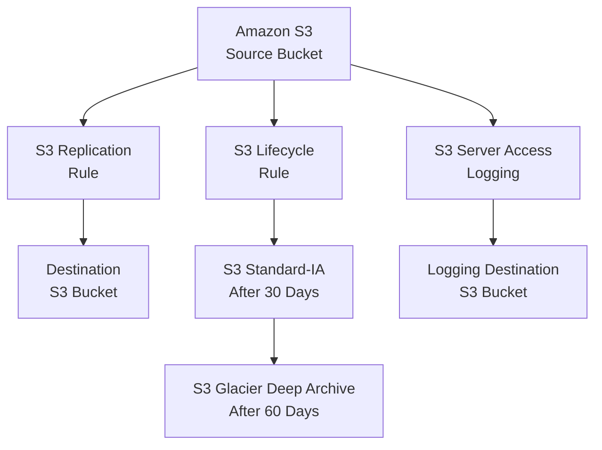

---

### S3 Event Notification Architecture

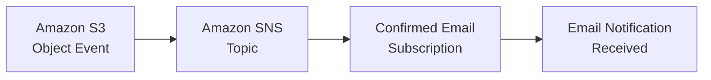

---

## Task 1: Configure an S3 Replication Rule

I configured an Amazon S3 replication rule to automatically replicate new objects from the source bucket to the destination bucket.

### Configuration

- Source bucket: `amit-first-bucket--1`
- Destination bucket: `amit-aws-bucket--2`
- Replication scope: Entire bucket
- Replication rule status: Enabled
- Destination storage class: S3 Standard-IA
- Versioning: Enabled on both source and destination buckets

### Verification

I uploaded an object to the source S3 bucket and verified that it was automatically replicated to the destination S3 bucket.

### Result

The S3 replication rule was configured successfully, and newly uploaded objects were automatically copied to the destination bucket.

### Screenshot

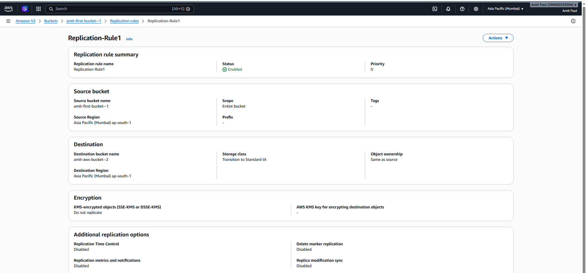

---

## Task 2: Verify Object Replication

I verified that the object uploaded to the source S3 bucket was successfully replicated to the destination S3 bucket.

### Verification

- The replicated object was available in the destination bucket.
- The destination object used the S3 Standard-IA storage class.
- The replication process completed successfully.

### Result

The object was successfully replicated from the source S3 bucket to the destination S3 bucket.

### Screenshot

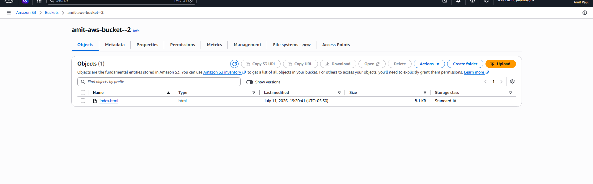

---

## Task 3: Perform S3 Batch Replication

I used Amazon S3 Batch Replication to replicate eligible existing objects from the source bucket to the destination bucket.

S3 live replication applies to new objects uploaded after the replication rule is enabled. S3 Batch Replication can be used to replicate eligible existing objects.

### Verification

- Batch operation status: Completed
- Completion percentage: 100%
- Total failed objects: 0

### Result

The S3 Batch Replication job completed successfully without any failed objects.

### Screenshot

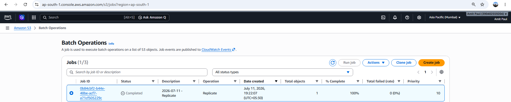

---

## Task 4: Configure an S3 Lifecycle Rule

I created an S3 Lifecycle rule to automatically transition objects between storage classes based on their age.

### Lifecycle Transitions

- Day 0: Object is uploaded to the S3 Standard storage class.
- Day 30: Object transitions to the S3 Standard-IA storage class.
- Day 60: Object transitions to the S3 Glacier Deep Archive storage class.

### Verification

- Lifecycle rule status: Enabled
- Rule scope: Entire bucket
- First transition: S3 Standard-IA after 30 days
- Second transition: S3 Glacier Deep Archive after 60 days

### Result

The S3 Lifecycle rule was created successfully.

> **Note:** S3 Lifecycle transitions are asynchronous and do not occur immediately.

### Screenshots

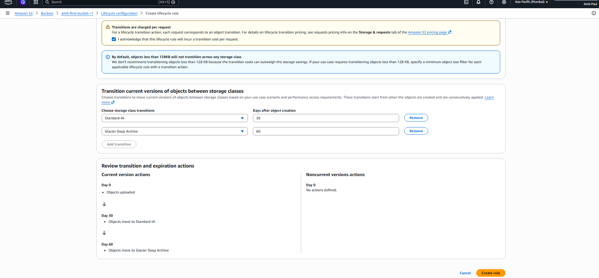

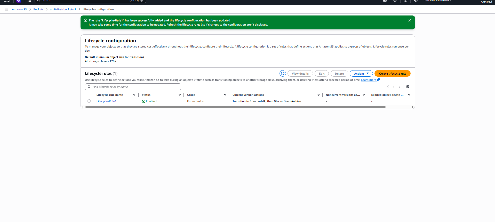

---

## Task 5: Configure S3 Server Access Logging

I enabled S3 Server Access Logging on the source bucket to record requests made to the bucket.

### Configuration

- Source bucket: `amit-first-bucket--1`
- Server access logging: Enabled
- Log destination bucket: `amit-aws-bucket--2`
- Log object key format: Date-based partitioning

### Result

S3 Server Access Logging was enabled successfully, and the access logs were configured to be delivered to the destination S3 bucket.

### Screenshot

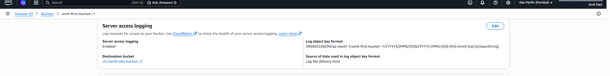

---

## Task 6: Verify Server Access Logs

I performed operations on the source S3 bucket and verified that server access log objects were delivered to the destination bucket.

### Verification

- Multiple server access log objects were created.
- The logs were stored in date-based folders.
- The log objects contained request information for the source S3 bucket.

### Result

S3 server access logs were successfully delivered to the destination S3 bucket.

> **Note:** S3 server access logs are delivered asynchronously on a best-effort basis. Log delivery may take some time.

### Screenshot

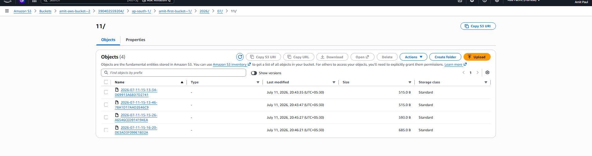
---

## Task 7: Create an Amazon SNS Topic and Email Subscription

I created an Amazon SNS topic and configured an email subscription to receive notifications generated by Amazon S3 events.

### Configuration

- SNS topic: `Topic1`
- Topic type: Standard
- Subscription protocol: Email
- Subscription status: Confirmed

### Verification

I confirmed the SNS subscription through the confirmation email sent by Amazon SNS.

### Result

The Amazon SNS topic and email subscription were created and confirmed successfully.

### Screenshot

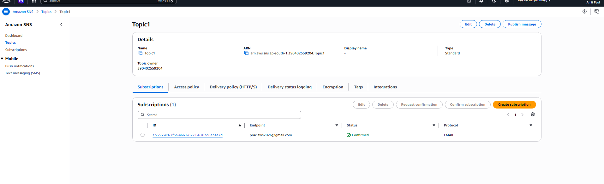

---

## Task 8: Configure an S3 Event Notification

I created an S3 Event Notification to publish object-level events from the source S3 bucket to the Amazon SNS topic.

### Event Configuration

- Event destination: Amazon SNS topic
- Event types: All object create events
- Event types: All object remove events
- SNS destination: `Topic1`

### Result

The S3 Event Notification was configured successfully and integrated with the Amazon SNS topic.

### Screenshot

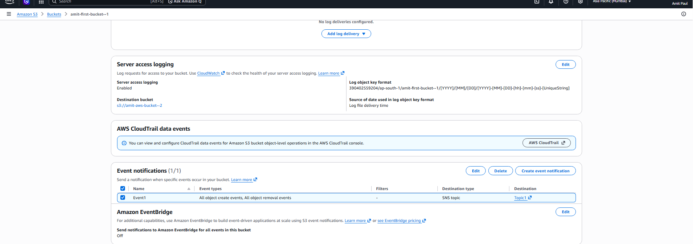

---

## Task 9: Verify the SNS Email Notification

I uploaded objects to the source S3 bucket and successfully received Amazon S3 event notifications through Amazon SNS.

The notification included event information such as:

- Event name
- AWS Region
- S3 bucket name
- Object key
- Object size
- Event timestamp

### Result

The complete event-driven notification workflow operated successfully.

### Screenshot

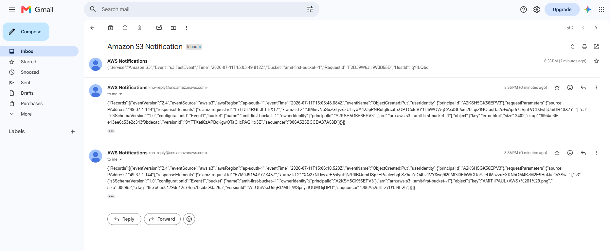

---

## Key Learnings

- S3 Replication can automatically copy new objects from a source bucket to a destination bucket.
- S3 Versioning must be enabled for replication.
- S3 Batch Replication can replicate eligible existing objects.
- S3 Lifecycle rules can help optimize storage costs by automatically transitioning objects between storage classes.
- Lifecycle transitions occur asynchronously and do not happen immediately.
- S3 Server Access Logging records requests made to an S3 bucket.
- Server access logs are delivered asynchronously on a best-effort basis.
- Amazon SNS uses a publish-and-subscribe messaging model.
- SNS email subscriptions must be confirmed before receiving notifications.
- S3 Event Notifications can publish object-level events to an Amazon SNS topic.
- Amazon S3 and Amazon SNS can be integrated to create an event-driven email-notification workflow.

---

## Final Outcome

In this hands-on lab, I successfully implemented:

- S3 Replication for newly uploaded objects
- S3 Batch Replication for eligible existing objects
- S3 Lifecycle management using Standard-IA and Glacier Deep Archive
- S3 Server Access Logging with a separate logging destination bucket
- Amazon SNS topic and confirmed email subscription
- S3 Event Notifications integrated with Amazon SNS
- Event-driven email notifications for S3 object-level activities

This lab improved my practical understanding of Amazon S3 data management, storage-cost optimization, access logging, replication, and event-driven architecture.
