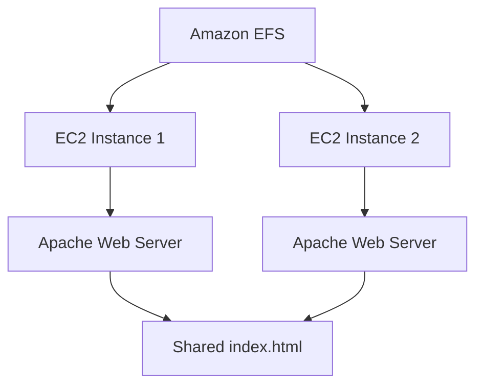

# Day 6 - Amazon EFS Hands-on Lab

## Objective

Learn how Amazon Elastic File System (EFS) provides scalable shared file storage for multiple EC2 instances.

---

## Services Used

- Amazon EC2
- Amazon EFS
- Amazon Linux 2023
- Apache HTTP Server (httpd)
- NFS v4.1

---

# Lab Architecture



---

# Tasks Performed

## Task 1: Launch Two Amazon Linux EC2 Instances

- Created two Amazon Linux 2023 EC2 instances.
- Verified both instances were running successfully.

---

## Task 2: Create Amazon EFS

- Created a new Amazon Elastic File System.
- Configured the file system for regional access.
- Used default encryption and Elastic throughput mode.

---

## Task 3: Mount Amazon EFS

- Installed required NFS utilities.
- Mounted the same EFS on both EC2 instances.
- Verified the mount using:

```bash
df -Th
```

---

## Task 4: Configure Apache Web Server

- Installed Apache HTTP Server.
- Started and enabled the httpd service.
- Used `/var/www/html` as the web root.

---

## Task 5: Create Shared Web Page

- Created a custom `index.html`.
- Stored the webpage inside the mounted EFS.
- Since both EC2 instances shared the same EFS, the webpage became available on both servers.

---

## Task 6: Verify Shared Storage

- Accessed both EC2 public IPs.
- Confirmed the same webpage was served from both servers.
- Verified that both EC2 instances were using the same shared file system.

---

# Result

Successfully configured Amazon EFS as shared storage for two EC2 instances and verified shared file access using Apache.

---

# Key Learnings

- Amazon EFS supports shared storage across multiple EC2 instances.
- EFS uses the NFS v4.1 protocol.
- A single file system can be mounted simultaneously on multiple servers.
- Changes made by one EC2 instance are immediately available to all mounted instances.
- Amazon EFS is commonly used for shared web content, CMS platforms, and application storage.

---
